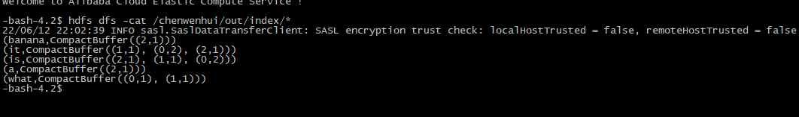

#### 作业一：使用 RDD API 实现带词频的倒排索引
 
- 源代码：https://github.com/wenhuichen8/bigdata-scala/tree/main/src/main/scala/indexreverse

##### 1、在hdfs上创建目录
 ```
 hdfs dfs -mkdir -p /chenwenhui/index
 ```
##### 2、上传索引文件到/home/student1/chenwenhui 目录下，之后put到hdfs中
 ```
  hdfs dfs -put   /home/student1/chenwenhui/index.txt   /chenwenhui/index
 ```
##### 3、上传倒排索引文件的jar 到/home/student1/chenwenhui 目录下，运行以下命令
 ```
 spark-submit --class indexreverse.IndexReverse  --master local[1]  /home/student1/chenwenhui/bigdata-scala-1.0-SNAPSHOT.jar
 ```
##### 4、查看运行结果
```
  hdfs dfs -cat /chenwenhui/out/index/*
```


#### 作业二：Distcp 的 Spark 实现

- 源代码 https://github.com/wenhuichen8/bigdata-scala/tree/main/src/main/scala/distcp

##### 1、在hdfs上创建目

```
 hadoop fs -mkdir -p chenwenhui-copy
```
##### 2、运行代码
```
spark-submit --class distcp.DistcpSpark  --master local[*]  /home/student1/chenwenhui/bigdata-scala-1.0-SNAPSHOT.jar -i  -m 3  "/chenwenhui" "/chenwenhui-copy"
```