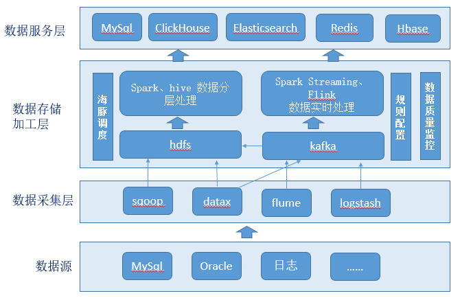

##### 1、基于 Lambda 架构的数据平台架构

数据平台分为三层：
- 1、数据采集层：通过sqoop、datax将数据库等结构化数据抽取都hdfs、kafka。通过flume或logstash将服务器日志、行为日志等非结构化数据实时采集到kafka。
- 2、数据存储加工层：分为俩大类，实时数据和非实时数据。非实时数据存储到hdfs，实时数据存储到kafka。对非实时数据通过海豚调度工具分布式的调用通过spark、hive对数据进行批量加工，加工时分不同层次进行加工。对于实时数据通过spark streaming、Flink进行流式处理。实时数据也可以从kafka保存到hdfs。
通过规则配置对加工的数据进行检查，及时发现数据质量问题和数据加工任务的异常。
- 3、数据服务层：数据经过数据存储加工层处理后进入数据服务层对外提供服务，根据服务的特点可将数据导入到Mysql、ClickHouse、Elasticsearch、Redis、Hbase。

##### 2、Lambda 架构的优缺点
Lambda 架构的目标是设计出一个能满足实时大数据系统关键特性的架构，包括：高容错、低延时和可扩展等。为了满足关键特性，Lambda架构整合离线和实时计算。
Lambda架构划分三层：批处理层、速度层、服务层。
- 批处理层对数据进行批量离线预处理，数据出错时可通过重新计算来恢复。
- 速度层对数据实时处理保证数据的低延时，速度层的复杂性通常比批处理层高，同时由于数据实时的变化，不好掌控，通过分开批处理层和速度层，可将复杂性隔离到速度层，可以很好的提高整个系统的可靠性。
- 服务层可以理解为用户层，即：响应用户的查询需求的层，在服务层合并批处理层和速度层的结果，作为最终的数据提供给用户使用。
总的来说Lambda 架构分为离线处理路径和实时处理路径两种处理模式。离线处理和实时处理都会产生相应的中间数据，离线的结果根据执行间隔不停的更新，实时的结果不断的用新数据迭代。将离线的实时生成的中间数据进行合并，抽取到一些数据库、缓存系统中，作为服务层提供用户查询。

Lambda 架构的缺点：
- 实时和批量结果不一致引起的冲突：由架构中可以得知，架构分实时和离线俩部分，两边结果的计算要保持一致比较困难。理论上来说，对于一些需要全量数据才能计算出的结果，90%的数据计算已经由离线负责完成，剩下10%是当前实时的计算结果，对俩个结果合并就能做到100%全量处理，并且保证低延时。但是，这
仅仅是理论的，实际在应用的过程中因为各种原因导致这个时间没对的上，导致衔接处出现了一些数据遗漏或者数据重复，就会让结果不准确。并且，过了一段时间后，离线部分追了上来，对错误进行了修正，又会导致在前端页面导致结果被修改的问题。也就是：理论是OK的，实施起来比较复杂，
难免出现问题，对技术团队的能力有较高的要求。
- 开发和维护的问题：由于要在俩个不同的流程中对数据进行处理，那针对一个业务就产生了两个代码库（一个离线计算、一个实时计算），这样会让系统的维护更加困难。
- 服务器存储开销大：由于有中间数据的存在，会导致计算出许多的中间数据用来支撑业务，这样会加大存储的压力。